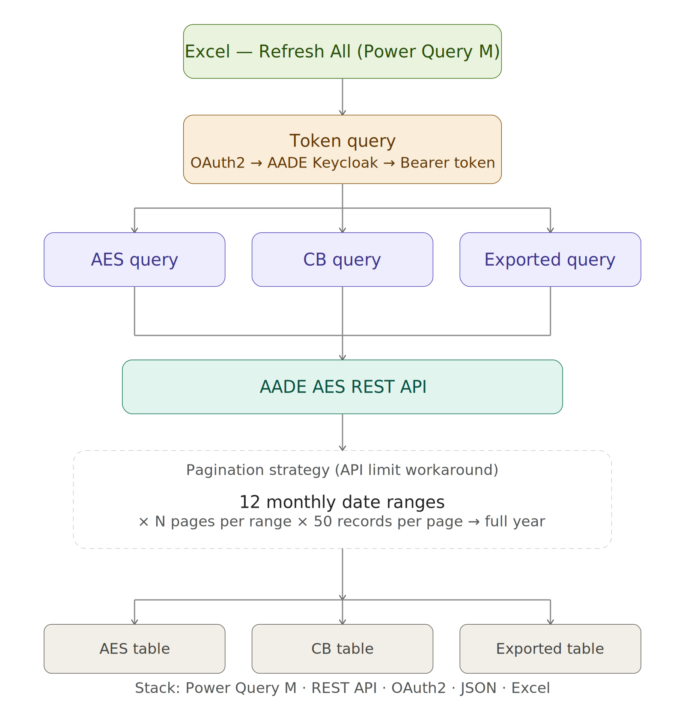

# AADE AES — Power Query Connector

Power Query M connector for the Greek Customs Authority (AADE) AES (Automated Export System) REST API. Authenticates via OAuth2, paginates through the full year's declarations, and delivers a clean, analysis-ready table in Excel.

---

## Architecture

## Queries

| File | Purpose |
|------|---------|
| `Token.m` | OAuth2 password-grant login — retrieves a Bearer token from AADE's Keycloak endpoint |
| `AES.m` | Fetches all export declarations, filters by company LRN prefix, extracts invoice number and MRN |
| `CB.m` | Same pipeline for CB-type declarations with alternative LRN prefix handling |
| `Exported.m` | Fetches declarations with server-side `declarationStatus=EX` filter for confirmed exports |

---

## Output columns

**AES / Exported:**

| Column | Description |
|--------|-------------|
| ΤΙΜΟΛΟΓΙΟ | Invoice number (extracted from LRN) |
| MRN | Movement Reference Number |
| ΗΜΕΡΟΜΗΝΙΑ | Status date |
| ΩΡΑ | Status time (24h format) |
| ΚΑΤΑΣΤΑΣΗ | Declaration state |
| ΜΗΝΥΜΑ | Procedure category code |

**CB:**

| Column | Description |
|--------|-------------|
| Invoice | Invoice number (extracted from LRN) |
| MRN | Movement Reference Number |
| Date | Status date |
| Status | Declaration state |

---

## Setup

1. Open your Excel workbook and go to **Data > Get Data > Launch Power Query Editor**
2. Create a new blank query for each `.m` file: **Home > Advanced Editor**, paste the code
3. In `Token.m`, replace:
   - `YOUR_AADE_USERNAME` with your AADE Trader Portal username
   - `YOUR_AADE_PASSWORD` with your AADE Trader Portal password
4. In `AES.m` and `Exported.m`, replace `YOUR_LRN_PREFIX` with your company's LRN prefix
5. In `CB.m`, replace `YOUR_CB_PREFIX` and `YOUR_CB_PREFIX_ALT` with your CB LRN prefixes
6. Load `Token` first, then reference it in the other queries via the `Token` step
7. Set query load order: Token → AES / CB / Exported

> **Note:** Credentials are stored in the Power Query formula bar. Use Excel's built-in credential manager or environment-specific parameter tables for production use.

---

## Tech stack

- Power Query M
- AADE AES REST API (`/tp-api/v2/search`)
- OAuth2 password grant (Keycloak)
- Excel (host environment)
